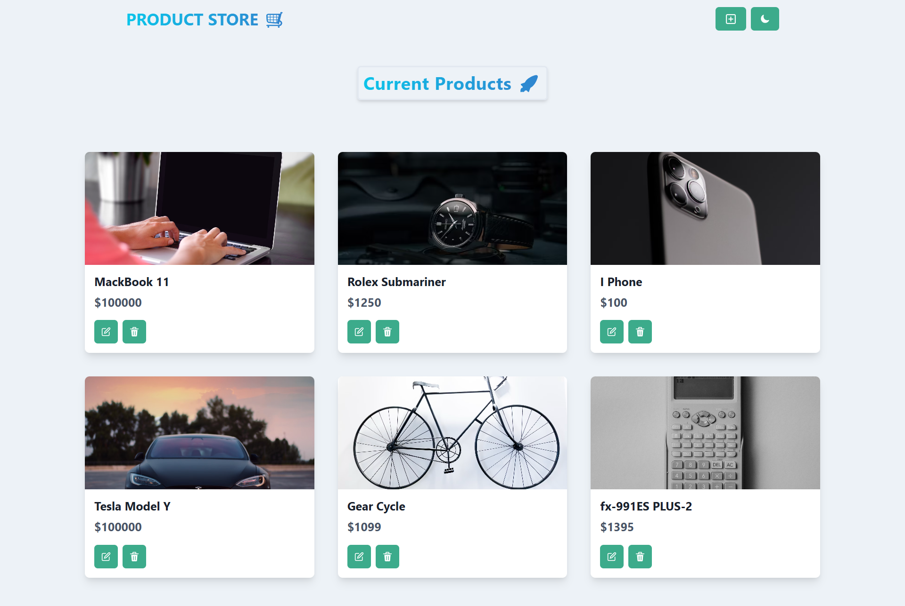

# 🛒 E-Commerce App (MERN Stack)

A simple full-stack E-Commerce application built using **MongoDB, Express.js, React, Node.js**, and **Chakra UI**. This project demonstrates CRUD operations for products with separate frontend and backend.

---

## 📸 Screenshot



---

## 📁 Project Structure

```
E-Commerce App/
├── backend/
│   ├── config/              # Database connection
│   ├── controllers/         # Product controller logic
│   ├── models/              # Mongoose models
│   ├── routes/              # Express routes
│   ├── server.js            # Entry point for backend
│   ├── .env                 # Environment variables
│   └── package.json
│
├── frontend/
│   ├── public/              # Static assets
│   ├── src/
│   │   ├── components/      # Reusable UI components
│   │   ├── pages/           # Page components
│   │   ├── store/           # Zustand store for state management
│   │   ├── theme/           # Chakra theme configuration
│   │   ├── App.jsx
│   │   └── main.jsx
│   ├── vite.config.js
│   └── package.json
│
├── .gitignore
└── README.md
````

---

## 🚀 Features

- ✅ Create, Read, Update, Delete Products
- ✅ Modern UI with Chakra UI
- ✅ Zustand for global state management
- ✅ REST API using Express.js
- ✅ MongoDB for database
- ✅ Modular and clean folder structure

---

## 🛠️ Tech Stack

### Frontend:
- React
- Vite
- Chakra UI
- Zustand

### Backend:
- Node.js
- Express.js
- MongoDB + Mongoose

---

## 🔧 Installation

### 1. Clone the repository

```bash
git clone https://github.com/your-username/e-commerce-app.git
cd e-commerce-app
````

---

### 2. Backend Setup

```bash
cd backend
npm install
```

* Create a `.env` file inside `backend/`:

```
MONGO_URI=your_mongodb_connection_string
PORT=5000
```

* Start backend server:

```bash
npm start
```

---

### 3. Frontend Setup

```bash
cd frontend
npm install
npm run dev
```

---

## 📦 API Endpoints

### Base URL: `http://localhost:5000/api/products`

| Method | Endpoint | Description       |
| ------ | -------- | ----------------- |
| GET    | `/`      | Get all products  |
| POST   | `/`      | Add a new product |
| PUT    | `/:id`   | Update a product  |
| DELETE | `/:id`   | Delete a product  |

---

## 📄 License

This project is open-source and free to use.

---

## 🙌 Author

[Tanish Kumar](https://www.linkedin.com/in/your-profile/)


